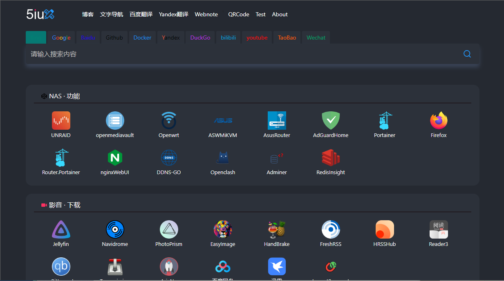
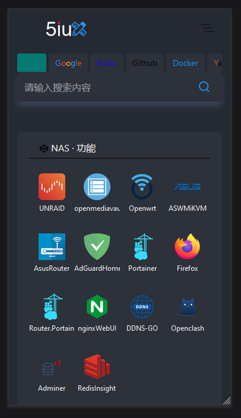

# 纯静态 html 的网页导航

这是一个有图标的网页导航，所以看起来更加的直观方便，如需要原来的纯文字导航，点击[这里](https://github.com/zheyiyuezhuo/webstack/tree/text)

界面演示：


## 介绍

修改自[5iux.github.io](https://github.com/5iux/5iux.github.io)，由于我原来就有`webstack`
这个仓库，我不知道怎么弄成`Fork`的，先在这里声明来源。

我也不懂代码，比如修改颜色我就是去`style.css`里一项项修改，观察网页的变化搞定的，如有问题请见谅！

## 使用

下载后打开`/webstack/index.html`就可以了

## 改动

1. 将主题修改为黑色模式，并在`style.css`中添加注释，如有需要更方便修改。

2. 关闭原来右上角自带的天气，如有需要可以将对应注释删除。

3. 将原来搜索引擎略作修改，并添加了其他搜索站点（dockerhub、github 等）
   

   - 问题：在手机页面中，由于横向距离较短，无法显示和选择后面的网站，我不大懂代码，只能期待有大佬能帮忙改进了。

     

     _无法右滑_

4. 将部分图标修改为图片显示。
   - 由于部分图标是通过引用和定义 class 实现的，我不太懂，摸索着将其修改为用图片显示

- 原来的代码：

```html
<li class="col-3 col-sm-3 col-md-3 col-lg-1">
  <a rel="nofollow" href="https://www.bilibili.com/" target="_blank"
    ><svg class="icon" aria-hidden="true">
      <use xlink:href="#icon-bili"></use></svg
    ><span>哔哩哔哩</span></a
  >
</li>
```

- 修改后的代码

```html
    <li class="col-3 col-sm-3 col-md-3 col-lg-1"><a rel="nofollow" href="https://unraid.net" target="_blank">
        </img><span>Unraid</span></a></li>
```

- `href="https://unraid.net"`为地址
- `src="./webstack/asset/unraid.png"`为图片地址
  - 有图床的小伙伴也可以修改为`src="https://png.xx/i/unraid.png"`
  - 如果有没有的图片，可以去[HD-Icons](https://github.com/xushier/HD-Icons)找，就是都是圆角矩形，我还是喜欢错落有致的
- `alt="unraid"`为图片名称，不修改也可以
- 由于完全没学过编程代码，所以只是实现了这个功能
- 如果有什么格式缩进等错误（肯定有），也是只能期待有大佬能优化了

4. 已将前边几块的网址清空，需要修改为自己的网址
5. 
